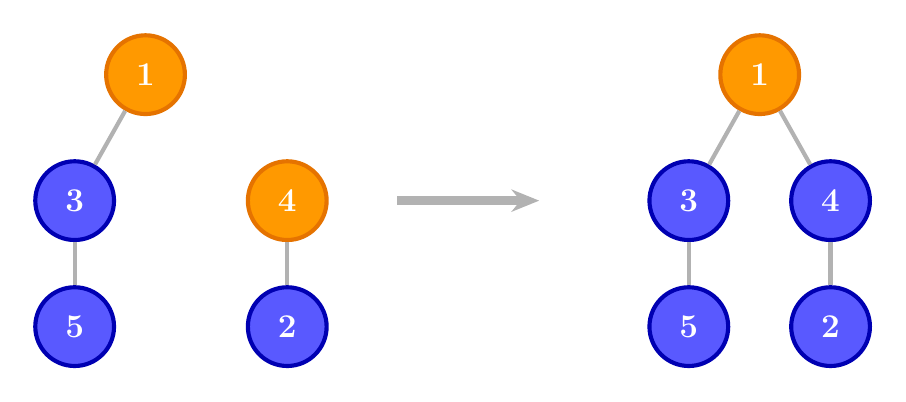

## Union-Find 

* **Disjunkte Mengen**: besitzen kein gemeinsames Element

* Datenstruktur **Tree**:
    - zwei Elemente im selben Baum gehören zur selben disjunkten Menge
    - der oberste Knoten ist der Repräsentant

* Operationen:
    - ***Union***: Zusammenführen zweier disjunkter Mengen 
        <!-- (einen Baum unter einen anderen stellen) -->
    - ***Find***: Ermitteln eines Repräsentanten einer disjunkten Menge
    

---

